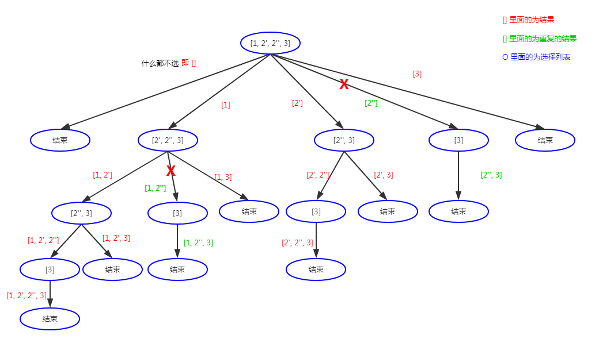

### [90. 子集 II](https://leetcode-cn.com/problems/subsets-ii/)

给定一个可能包含重复元素的整数数组 *nums*，返回该数组所有可能的子集（幂集）。

说明：解集不能包含重复的子集。

**示例:**

```
输入: [1,2,2]
输出:
[
  [2],
  [1],
  [1,2,2],
  [2,2],
  [1,2],
  []
]
```

### 解题思路

题目是排列组合、求解集的问题，使用回溯算法。

本题与[78. 子集](../subsets/README.md)很类似，唯一不同的是 *nums* 里可能会出现重复数字。按照惯例，使用回溯六步法来解题。

#### 1. 画递归树，找变量



观察递归树，发现每一层的选择列表是与上一层选择的数之后的剩余列表，因此需要增加一个变量表示可供选择的列表的开始下标。其中出现一些重复的结果，需要进行剪枝，在剪枝那部分再分析。

```csharp
// path 表示临时保存的结果
// start 表示可供选择的列表的开始下标
void Backtrack(int[] nums, List<int> path, int start);
```

#### 2. 找结束条件

通过递归树可知，每个结果都需要保存，因此不需要结束条件，或者当 `start` 超过数组边界时结束。

```csharp
ans.Add(new List<int>(path));
```

#### 3. 找选择列表

在第一步提到，当层的选择列表与上一层选择的数之后的剩余列表。

```csharp
for(int i = start; i < nums.Length; i++) {
    // do something...
}
```

#### 4. 判断是否需要剪枝

从递归树可知，有重复的路径，因此需要剪枝。仔细观察发现，出现重复的路径都是因为与当前选择的数字重复选择了，例如 `[1, 2']` 和 `[1, 2'']` （其中逗号表示出现的顺序），因为在 `[1, 2']` 已经选择了 `2` ，因此后续出现的 `2` 要剪掉。

这里要新增一数组 `visited` 来保存是否选择了数字。尤其要注意需要先对 `nums` 进行排序，不然相同的数字未必出现在相邻的位置。

```csharp
// 因为递归树是深度优先遍历，当对 [1, 2'] 完成遍历后，退回到 [1] 的状态再选择 2'' 时才要剪枝，因此使用 !visited[i-1]
if(i > 0 && !visited[i-1] && nums[i] == nums[i-1]) {
    continue;
}
```

#### 5. 做出选择(即for 循环里面的)

```csharp
void Backtrack(int[] nums, List<int> path, int start) {
    // 选择列表
    for(int i = start; i < nums.Length; i++) {
        if(i > 0 && !visited[i-1] && nums[i] == nums[i-1]) {      // 剪枝
            continue;
        }
        path.Add(nums[i]);
        visited[i] = true;
        Backtrack(nums, path, i+1);
    }
}
```

#### 6. 撤消选择

```csharp
void Backtrack(int[] nums, List<int> path, int start) {
    // 选择列表
    for(int i = start; i < nums.Length; i++) {
        if(i > 0 && !visited[i-1] && nums[i] == nums[i-1]) {      // 剪枝
            continue;
        }
        path.Add(nums[i]);
        visited[i] = true;
        Backtrack(nums, path, i+1);
        path.Remove(nums[i]);
        visited[i] = false;
    }
}
```

### 代码

```csharp
public class Solution {
    private IList<IList<int>> ans;
    private bool[] visited;

    public IList<IList<int>> SubsetsWithDup(int[] nums) {
        ans = new List<IList<int>>();
        if(nums == null || nums.Length == 0) {
            return ans;
        }

        visited = new bool[nums.Length];
        Array.Sort(nums);
        Backtrack(nums, new List<int>(), 0);
        return ans;
    }

    public void Backtrack(int[] nums, List<int> path, int start) {
        ans.Add(new List<int>(path));
        // 选择列表
        for(int i = start; i < nums.Length; i++) {
            if(i > 0 && !visited[i-1] && nums[i] == nums[i-1]) {      // 剪枝
                continue;
            }
            path.Add(nums[i]);
            visited[i] = true;
            Backtrack(nums, path, i+1);
            path.RemoveAt(path.Count-1);
            visited[i] = false;
        }
    }
}
```

### 复杂度分析

- 时间复杂度：$O(n×2^n)$。一共 $2^n$ 个状态，每种状态需要 $O(n)$ 的时间来构造子集。
- 空间复杂度：$O(n)$。临时数组 t 的空间代价是 $O(n)$，递归时栈空间的代价为 $O(n)$。