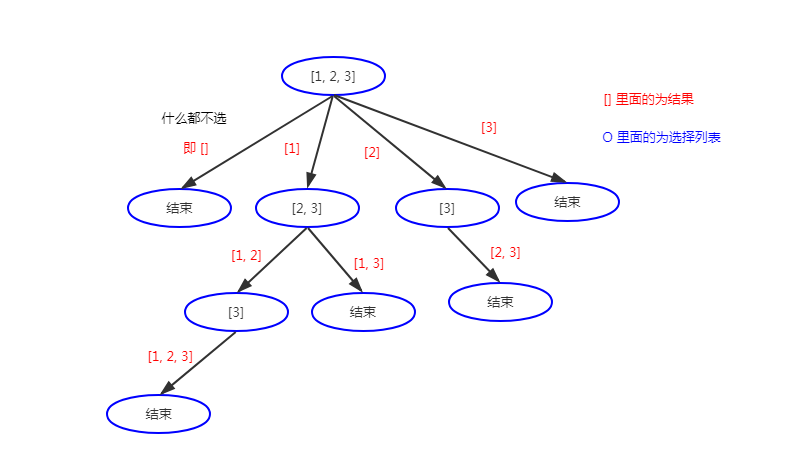

### [78. 子集](https://leetcode-cn.com/problems/subsets/)

给定一组不含重复元素的整数数组 nums，返回该数组所有可能的子集（幂集）。

说明：解集不能包含重复的子集。

**示例:**

```
输入: nums = [1,2,3]
输出:
[
  [3],
  [1],
  [2],
  [1,2,3],
  [1,3],
  [2,3],
  [1,2],
  []
]
```

### 解题思路

题目是排列组合、求解集的问题，使用回溯算法。

#### 1. 画递归树，找变量



观察递归树，发现每一层的选择列表是与上一层选择的数之后的剩余列表，因此需要增加一个变量表示可供选择的列表的开始下标。

```csharp
// path 表示临时保存的结果
// start 表示可供选择的列表的开始下标
void Backtrack(int[] nums, List<int> path, int start);
```

#### 2. 找结束条件

通过递归树可知，每个结果都需要保存，因此不需要结束条件，或者当 `start` 超过数组边界时结束。

```csharp
ans.Add(new List<int>(path));
```

#### 3. 找选择列表

在第一步提到，当层的选择列表与上一层选择的数之后的剩余列表。

```csharp
for(int i = start; i < nums.Length; i++) {

}
```

#### 4. 断是否需要剪枝

从递归树可知，没有重复的路径，因此不需要剪枝。

#### 5. 做出选择(即for 循环里面的)

```csharp
void Backtrack(int[] nums, List<int> path, int start) {
    // 选择列表
    for(int i = start; i < nums.Length; i++) {
        path.Add(nums[i]);
        Backtrack(nums, path, i+1);
    }
}
```

#### 6. 撤消选择

```csharp
void Backtrack(int[] nums, List<int> path, int start) {
    ans.Add(new List<int>(path));
    // 选择列表
    for(int i = start; i < nums.Length; i++) {
        path.Add(nums[i]);
        Backtrack(nums, path, i+1);
        path.Remove(nums[i]);
    }
}
```

### 代码

```csharp
public class Solution {
    private IList<IList<int>> ans;

    public IList<IList<int>> Subsets(int[] nums) {
        ans = new List<IList<int>>();
        if(nums == null || nums.Length == 0) {
            return ans;
        }
        Backtrack(nums, new List<int>(), 0);
        return ans;
    }

    public void Backtrack(int[] nums, List<int> path, int start) {
        ans.Add(new List<int>(path));

        // 选择列表
        for(int i = start; i < nums.Length; i++) {
            path.Add(nums[i]);

            Backtrack(nums, path, i+1);

            path.Remove(nums[i]);
        }
    }
}
```

### 复杂度分析

- 时间复杂度：$O(n×2^n)$。一共 $2^n$ 个状态，每种状态需要 $O(n)$ 的时间来构造子集。
- 空间复杂度：$O(n)$。临时数组 t 的空间代价是 $O(n)$，递归时栈空间的代价为 $O(n)$。